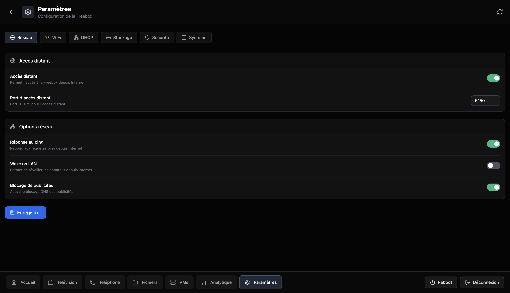
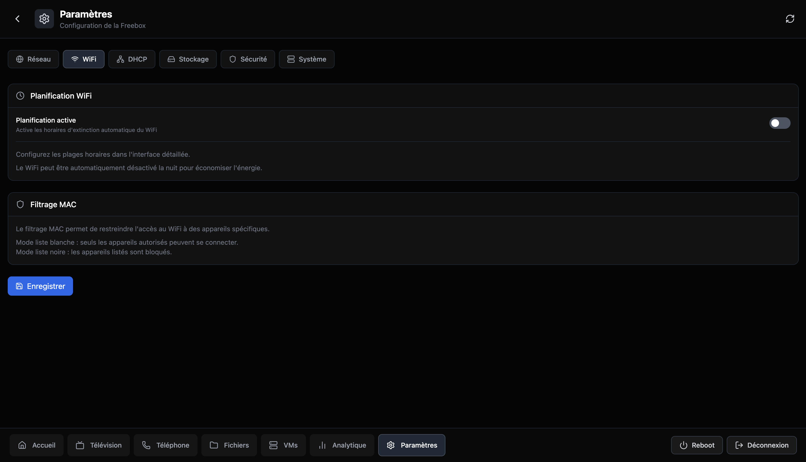
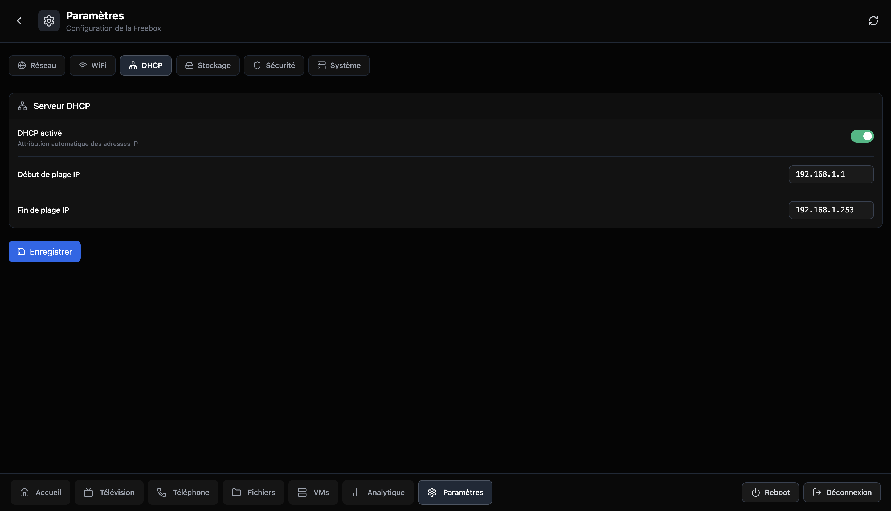
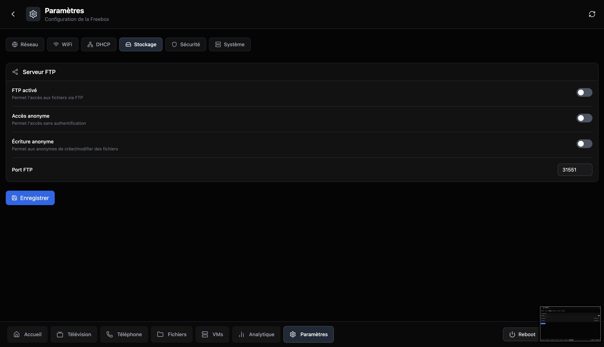
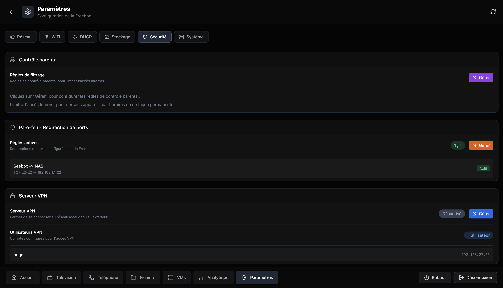
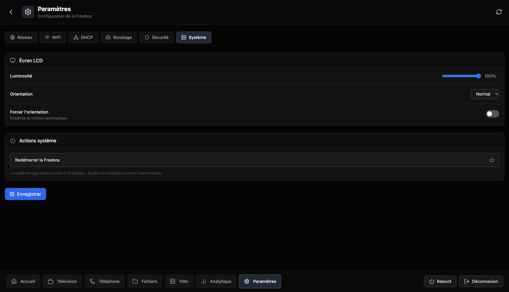

# Freebox OS Ultra Dashboard

<div align="center">


**Un dashboard moderne et complet pour la Freebox Ultra**

[Fonctionnalites](#fonctionnalites) | [Installation](#installation) | [Configuration](#configuration) | [Utilisation](#utilisation)

</div>

---


> **⚠️ Version BETA** - Ce projet est en cours de developpement. Des bugs peuvent etre presents et certaines fonctionnalites peuvent ne pas fonctionner comme prevu. N'hesitez pas a [signaler les problemes](../../issues) rencontres.

## Apercu

Freebox OS Ultra Dashboard est une interface web alternative pour gerer votre Freebox Ultra. Construit avec React 19 et Express 5, il offre une experience utilisateur fluide et moderne avec des donnees en temps reel.

### Captures d'ecran

<details>
<summary>Voir les captures d'ecran</summary>








</details>

## Fonctionnalites

### Dashboard Principal
- **Debit en temps reel** - Surveillance du debit descendant/montant avec graphiques sparkline
- **Statut de connexion** - Etat de la ligne fibre, type de connexion, latence
- **Informations systeme** - Temperature CPU, utilisation memoire, uptime
- **Appareils connectes** - Liste des appareils sur le reseau local

### WiFi
- **Gestion des reseaux** - Configuration des bandes 2.4GHz, 5GHz et 6GHz
- **WPS** - Activation/desactivation du WPS avec bouton push
- **Filtrage MAC** - Gestion de la liste blanche/noire
- **Appareils connectes** - Visualisation des clients WiFi en temps reel

### VPN
- **Multi-protocoles** - Support OpenVPN (routed/bridge), PPTP, WireGuard
- **Gestion des serveurs** - Demarrage/arret des serveurs VPN
- **Statistiques** - Nombre de connexions actives

### Telechargements
- **Gestionnaire complet** - Ajout de torrents, URLs directes
- **Progression en temps reel** - Vitesse, ETA, statut
- **Controle** - Pause, reprise, suppression

### Fichiers
- **Explorateur** - Navigation dans les fichiers de la Freebox
- **Operations** - Copie, deplacement, renommage, suppression
- **Partage** - Creation de liens de partage

### Telephonie
- **Journal d'appels** - Historique complet avec filtres
- **Contacts** - Gestion du repertoire
- **Repondeur** - Ecoute des messages vocaux

### TV
- **Guide des programmes** - EPG en temps reel
- **Chaines** - Liste des chaines disponibles
- **Enregistrements** - Gestion des enregistrements programmes

### Machines Virtuelles
- **Gestion des VMs** - Demarrage, arret, redemarrage
- **Statistiques** - Utilisation CPU, memoire, disque
- **Configuration** - Parametres des machines virtuelles

### Controle Parental
- **Profils** - Creation de profils par utilisateur
- **Filtres** - Blocage de sites et categories
- **Horaires** - Plages horaires d'acces

### Analytiques
- **Historique bande passante** - Graphiques sur 1h, 24h, 7j
- **Temperatures** - Evolution des temperatures du systeme
- **Statistiques reseau** - Donnees detaillees de connexion

### Parametres
- **Configuration Freebox** - Parametres systeme
- **Mode sombre** - Theme adapte
- **Reboot/Eteindre** - Controle de la Freebox

## Prerequis

- **Node.js** 18+ (recommande: 20+)
- **npm** ou **yarn**
- **Freebox Ultra** avec acces reseau local
- Navigateur moderne (Chrome, Firefox, Safari, Edge)

## Installation

### 1. Cloner le depot

```bash
git clone https://github.com/HGHugo/FreeboxOS-Ultra-Dashboard.git
cd FreeboxOS-Ultra-Dashboard
```

### 2. Installer les dependances

```bash
npm install
```

### 3. Configurer l'environnement

Copiez le fichier d'exemple et modifiez-le selon vos besoins :

```bash
cp .env.example .env
```

Contenu du fichier `.env` :

```env
# Configuration Freebox
FREEBOX_URL=https://mafreebox.freebox.fr
FREEBOX_LOCAL_IP=192.168.1.254
FREEBOX_APP_ID=fr.freeboxos.dashboard
FREEBOX_APP_NAME=Freebox Dashboard
FREEBOX_APP_VERSION=1.0.0
FREEBOX_DEVICE_NAME=Dashboard Web App

# Serveur
SERVER_PORT=3001
```

> **Note:** `FREEBOX_LOCAL_IP` doit correspondre a l'adresse IP locale de votre Freebox (generalement `192.168.1.254` ou `192.168.0.254`)

### 4. Autoriser l'application sur la Freebox

Au premier lancement, vous devrez autoriser l'application :

1. Lancez l'application avec `npm run dev`
2. Allez sur http://localhost:5173
3. Cliquez sur "Connecter" dans l'interface
4. **Sur votre Freebox** : Un message s'affichera sur l'ecran LCD
5. Appuyez sur la **fleche droite** (>) de la Freebox pour autoriser
6. L'application est maintenant connectee !

> **Important:** Pour certaines fonctionnalites (WPS, VPN, etc.), vous devrez peut-etre re-autoriser l'application avec des permissions supplementaires. Allez dans les parametres de la Freebox OS > Gestion des acces > Applications.

## Utilisation

### Mode Developpement

Lance le serveur backend et le frontend en mode hot-reload :

```bash
npm run dev
```

- Frontend : http://localhost:5173
- Backend API : http://localhost:3001

### Build Production

```bash
npm run build
```

Les fichiers compiles seront dans le dossier `dist/`.

### Preview Production

```bash
npm run preview
```

## Deploiement en Production

### Option 1 : Lancement direct

```bash
# Build du frontend
npm run build

# Lancer le serveur (frontend + API)
npm start
```

Le serveur sera accessible sur `http://localhost:3001`

### Option 2 : Deploiement avec PM2 (recommande)

PM2 est un gestionnaire de processus Node.js qui permet de garder l'application en ligne 24/7.

```bash
# Installer PM2 globalement
npm install -g pm2

# Build du frontend
npm run build

# Lancer le serveur avec PM2
pm2 start npm --name "freebox-dashboard" -- start

# Configurer le demarrage automatique au boot
pm2 startup
pm2 save
```

Commandes PM2 utiles :
```bash
pm2 status                     # Voir le statut
pm2 logs freebox-dashboard     # Voir les logs
pm2 restart freebox-dashboard  # Redemarrer
pm2 stop freebox-dashboard     # Arreter
pm2 delete freebox-dashboard   # Supprimer
```

Acceder au dashboard depuis n'importe quel appareil du reseau :
```
http://<IP_MACHINE>:3001
```

## Architecture

```
freebox-os-ultra-dashboard/
├── src/                    # Code source frontend
│   ├── api/                # Client API
│   ├── components/         # Composants React
│   │   ├── layout/         # Layout principal
│   │   ├── modals/         # Modals (WiFi, VPN, etc.)
│   │   ├── ui/             # Composants UI reutilisables
│   │   └── widgets/        # Widgets du dashboard
│   ├── hooks/              # Hooks React personnalises
│   ├── pages/              # Pages de l'application
│   ├── stores/             # State management (Zustand)
│   ├── types/              # Types TypeScript
│   └── utils/              # Utilitaires
├── server/                 # Code source backend
│   ├── middleware/         # Middlewares Express
│   ├── routes/             # Routes API
│   └── services/           # Services (Freebox API)
├── dist/                   # Build de production
└── package.json
```

## Technologies

| Categorie | Technologies |
|-----------|-------------|
| **Frontend** | React 19, TypeScript, Vite, Recharts, Lucide Icons |
| **State** | Zustand |
| **Backend** | Express 5, Node.js, TypeScript |
| **API** | Freebox OS API v4/v8 |
| **Style** | Tailwind CSS (via classes) |

## API Freebox

Ce projet utilise l'API officielle Freebox OS. Documentation : [dev.freebox.fr](https://dev.freebox.fr/sdk/os/)

### Endpoints implementes

- `/api/connection` - Statut de connexion
- `/api/lan` - Appareils reseau
- `/api/wifi` - Configuration WiFi
- `/api/downloads` - Gestionnaire de telechargements
- `/api/fs` - Systeme de fichiers
- `/api/calls` - Journal d'appels
- `/api/contacts` - Repertoire telephonique
- `/api/tv` - Guide TV et enregistrements
- `/api/vm` - Machines virtuelles
- `/api/parental` - Controle parental
- `/api/settings` - Parametres systeme
- `/api/speedtest` - Test de debit

## Contribution

Les contributions sont les bienvenues !

### Guidelines

- Respectez le style de code existant
- Ajoutez des types TypeScript pour tout nouveau code
- Testez vos modifications avant de soumettre
- Documentez les nouvelles fonctionnalites

## FAQ

<details>
<summary><strong>L'application ne se connecte pas a la Freebox</strong></summary>

1. Verifiez que vous etes sur le meme reseau local que la Freebox
2. Verifiez l'adresse IP dans `.env`
3. Assurez-vous que l'API Freebox est activee (Freebox OS > Parametres > Mode avance > API)
</details>

<details>
<summary><strong>Erreur "Droits insuffisants"</strong></summary>

Certaines fonctionnalites necessitent des permissions supplementaires :
1. Allez dans Freebox OS > Parametres > Gestion des acces > Applications
2. Trouvez "Freebox Dashboard"
3. Activez les permissions necessaires (Modification des reglages, etc.)
</details>

<details>
<summary><strong>Les donnees ne se mettent pas a jour</strong></summary>

1. Verifiez la console du navigateur pour les erreurs
2. Redemarrez le serveur backend
3. Verifiez que le token n'a pas expire
</details>

## Licence

Ce projet est sous licence MIT. Voir le fichier [LICENSE](LICENSE) pour plus de details.


### Design

Le design de ce dashboard a ete realise par **[@powl_d](https://x.com/powl_d)**. Merci pour ce magnifique travail !

### Remerciements

- [Free](https://www.free.fr) pour la Freebox et son API ouverte
- [Freebox SDK](https://dev.freebox.fr) pour la documentation
- La communaute open source pour les excellentes bibliotheques utilisees

---

<div align="center">

**Fait avec amour pour les utilisateurs de Freebox Ultra**

</div>
